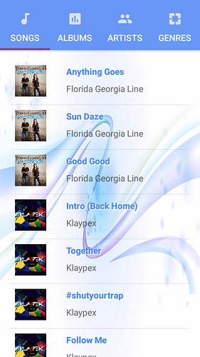

# Musical Structure App

Project #4 for Android Basics by Google Nanodegree Program

<h3>App Design</h3>
<table>
  <tr>
    <th>Criteria</th>
    <th>Meets Specifications</th>
  </tr>
  <tbody>
    <tr>
      <td>
        
Suitability

      </td>
      <td>
        
The app’s structure is suitable for a music player app. A similarly structured app which focuses on audiobooks, podcasts, or other audio media is also acceptable.

      </td>
    </tr>
    <tr>
      <td>
        
Clarity

      </td>
      <td>
        
The purpose of each activity is easy for a user to understand through the UI design and feature labeling.

      </td>
    </tr>
    <tr>
      <td>
        
Number of Activities

      </td>
      <td>
        
The app contains 2 to 6 activities

      </td>
    </tr>
  </tbody>
</table>

<h3>Layout</h3>
<table>
  <tr>
    <th>Criteria</th>
    <th>Meets Specifications</th>
  </tr>
  <tbody>
    <tr>
      <td>
        
Structure

      </td>
      <td>
        
The app contains multiple activities, each labelled, which together make a cohesive music app.

      </td>
    </tr>
    <tr>
      <td>
        
Labelling

      </td>
      <td>
        
Features in the app are clearly defined either by labelling or images. For example, a button to play music could use a universally recognized triangular "Play" symbol or could have the text label "Play".

      </td>
    </tr>
    <tr>
      <td>
        
Buttons

      </td>
      <td>
        
Each activity contains button(s) which link it to other activities a user should be able to reach from that activity. For instance, a ‘Library’ activity might contain a button to move to the ‘Now Playing’ activity.

      </td>
    </tr>
    <tr>
      <td>
        
Layout Best Practices

      </td>
      <td>
        
The code adheres to all of the following best practices:

        <ul>
          <li>Text sizes are defined in sp</li>
          <li>Lengths are defined in dp</li>
          <li>Padding and margin is used appropriately, such that the views are not crammed up against each other.</li>
        </ul>
      </td>
    </tr>
  </tbody>
</table>

<h3>Functionality</h3>
<table>
  <tr>
    <th>Criteria</th>
    <th>Meets Specifications</th>
  </tr>
  <tbody>
    <tr>
      <td>
        
Runtime Errors

      </td>
      <td>
        
The code runs without errors

      </td>
    </tr>
    <tr>
      <td>
        
OnClickListeners

      </td>
      <td>
        
Each button’s behavior is determined by an OnClickListener in the Java code rather than by the android:onClick attribute in the XML Layout.

      </td>
    </tr>
    <tr>
      <td>
        
Intents

      </td>
      <td>
        
Each button properly opens the intended activity using an explicit Intent.

      </td>
    </tr>
    <tr>
      <td>
        
Custom Adapter

      </td>
      <td>
        
App uses a custom adapter to populate the layout with views based on instances of the custom class.

      </td>
    </tr>
    <tr>
      <td>
        
Data Storage and Retrieval

      </td>
      <td>
        
Information about instances of the custom class are stored in an appropriate data structure (e.g. ArrayList, Array).

        
When the information needs to be displayed, it is efficiently retrieved (e.g. Looping).

      </td>
    </tr>
    <tr>
      <td>
        
Custom Class

      </td>
      <td>
        
Data about each song (or equivalent audio media such as podcast episode) should be stored in a custom class that contains at least 2 states (e.g. Song Name, Artist Name)

        
If images are included (e.g. Album Art), they are stored as drawables. All drawables are stored at multiple densities. Images are not required.

      </td>
    </tr>
  </tbody>
</table>

<h3>Code Quality</h3>
<table>
  <tr>
    <th>Criteria</th>
    <th>Meets Specifications</th>
  </tr>
  <tbody>
    <tr>
      <td>
        
Code Formatting

      </td>
      <td>
        
The code is properly formatted:

        <ul>
          <li>No unnecessary blank lines</li>
          <li>No unused variables or methods</li>
          <li>No commented out code</li>
        </ul>
        
The code also has proper indentation when defining variables and methods.

      </td>
    </tr>
    <tr>
      <td>
        
Readability

      </td>
      <td>
        
Code is easily readable so that a fellow programmer can understand the purpose of the app.

      </td>
    </tr>
    <tr>
      <td>
        
Naming Conventions

      </td>
      <td>
        
All variables, methods, and resource IDs are descriptively named so that another developer reading the code can easily understand their function.

      </td>
    </tr>
  </tbody>
</table>

<em>Requirements copied from: <a href="http://udacity.com">udacity.com</a>.</em>

 

 
  
  

